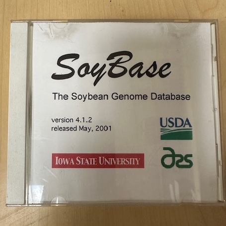

## 34 Years of SoyBase: From Genetic Maps to Pan-genome Resources for Soybean Improvement

In the early 1990s, USDA ARS anticipated a coming genomic revolution and recognized that crop research needed a centralized, community accessible data resource. In 1992, Dr. Randy Shoemaker was selected to lead the effort to develop a soybean genetic and genomic database. At that time, SoyBase existed entirely on a single computer in the Shoemaker lab. SoyBase was developed to serve as a central repository for soybean RFLP, RAPD, SSR, and SNP marker datasets. 

### Data Sharing in the Pre-Internet Era

Before the World Wide Web (WWW) was established, soybean researchers and breeders used the [ACeDB]( https://github.com/richarddurbin/acedb/) browser to view genetic maps. The ACeDB program required the data be stored on the local computers. To view the soybean genetic maps collected by the SoyBase curator data was distributed directly to researchers on CDs.  To remain current, researchers requested updated CDs, which the SoyBase curator mailed via USPS.

  
  
&copy; 2026 SoyBase

